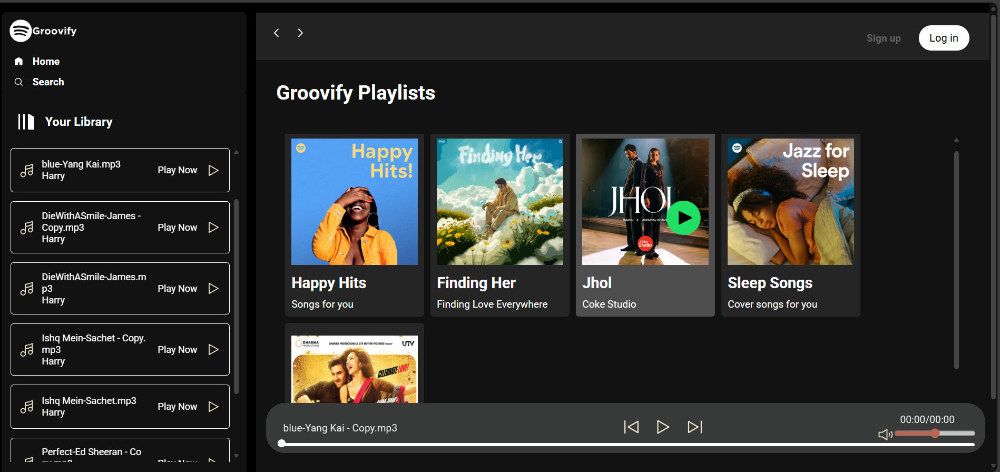
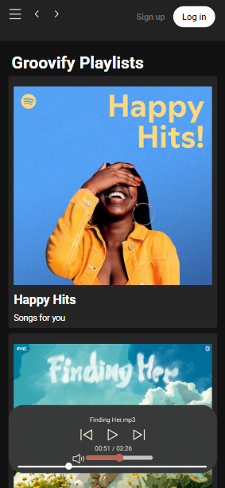

# Groovify – A Spotify-Inspired Music Web App

Groovify is a sleek and responsive **Spotify-inspired music player UI** built using **HTML, CSS, and JavaScript**. Designed to mimic modern music platforms, Groovify brings together beautiful design and interactive functionality — ideal for showcasing UI/UX skills, responsive layouts, and JavaScript DOM manipulation.

---

## Features

-  Spotify-style sidebar navigation (Home, Search, Library)
-  Scrollable playlist cards
-  Responsive bottom music control bar
-  Dark-themed UI with custom scrollbars
-  Mobile-friendly layout with Flexbox and Media Queries
-  Smooth user interactions with JavaScript

---

## Tech Stack

| Tech        | Role                         |
|-------------|------------------------------|
| HTML5       | Structure and layout         |
| CSS3        | Styling + Utility classes    |
| JavaScript  | Interactivity and logic      |
| Flexbox     | Responsive UI layout         |
| Media Queries | Mobile adaptability         |

---

## Responsiveness Strategy

- Utilized **Flexbox layout** to arrange and reflow elements on different screen sizes.
- Integrated **media queries** for adaptive design (stacking cards, hiding sidebar).
- Used **relative units** like `%`, `em`, and `vh/vw` for flexible sizing.
- Ensured scrollable content with customized scrollbars (WebKit + Firefox support).

---

## Screenshots

> - `home-desktop.png`

> - `mobile-view.png`

---

## Folder Structure
Groovify/
├── index.html
├── style.css
├── utility.css
├── script.js
├── assets/
│ ├── images/
│ └── music/
└── README.md

---

## Key JavaScript Concepts Used

- `querySelector` and DOM traversal
- Event handling (`addEventListener`)
- Basic callback pattern
- Optionally: `Audio()` API for song playback
- Toggle-based UI updates (like play/pause)

---

## What Makes This Stand Out?

- Clean and modern UI that mirrors Spotify’s layout
- Real-world front-end interview concepts (DOM, responsiveness, JS interactivity)
- Designed with scalability — easy to add playlists, music, authentication, etc.
- Fully functional prototype with **zero frameworks** (vanilla HTML/CSS/JS)

---

## Future Enhancements

- Integrate real song playback using `Audio` API
- Add search functionality
- Connect to Spotify API for real-time music
- User authentication (login/signup)
- Like, queue, and playlist management

---

## Author

**[Panchami Hegde]** – MERN Stack Developer  
📧 [panchhegde2004@gmail.com]  
🔗 [LinkedIn](https://www.linkedin.com/in/panchami-hegde/) 

